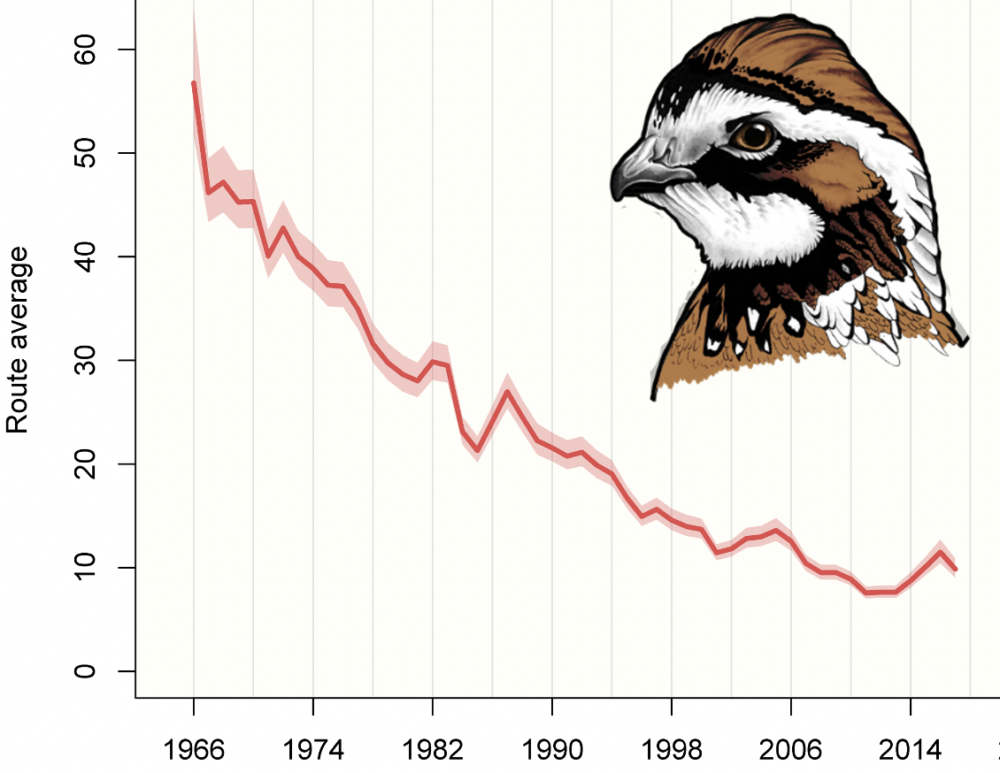
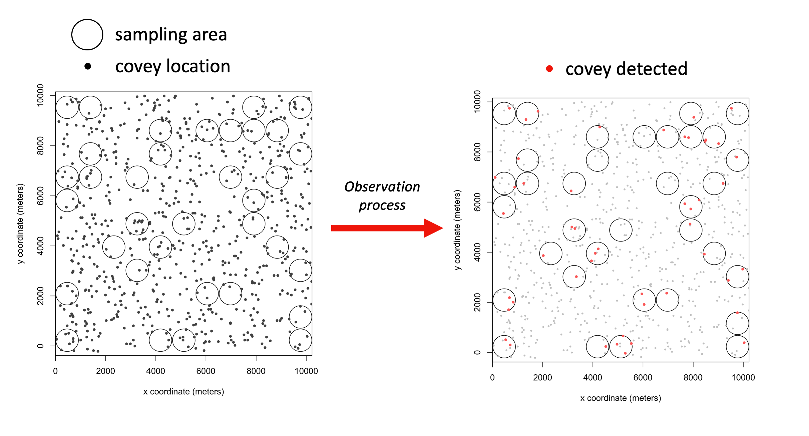
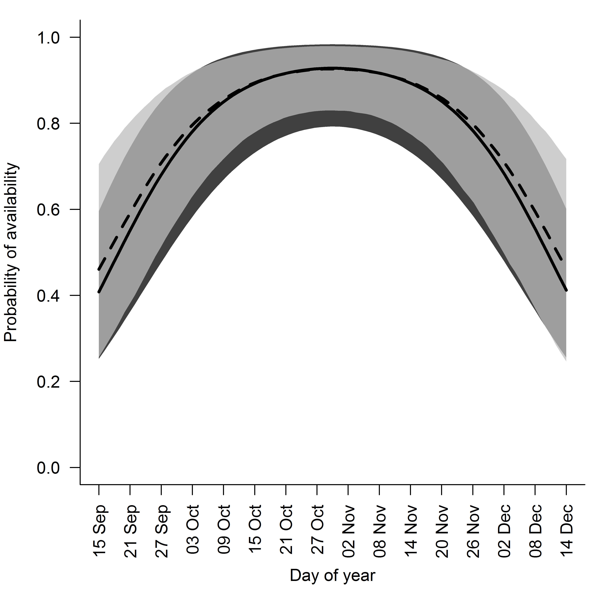

```{r setup, include=FALSE}
knitr::opts_chunk$set(echo = FALSE)
```
The following is a brief companion piece to "Addressing Temporal Variability in Bird Calling with Design and Estimation: A Northern Bobwhite Example"[@Yeiser2020bJWM].

### Context

One of the foundational questions of avian population management is "how many individuals are in this certain area?". A common approach to answering this question is fitting statistical models (e.g., distance sampling models) to data on unmarked individuals (e.g., counts). Density estimates influence decisions about monitoring programs, conservation policies, and importantly for game species, harvest regulations.

Northern bobwhite are declining throughout their range, are subject to local extirpation if isolated from other populations, and are subject to hunter harvest. Getting reliable density estimates is paramount to sustainable harvest. Unfortunately, during autumn when density estimates would be most informative to setting harvest regulations, bobwhites are not easy to survey. 

```{r fig.cap="The range wide decline in northern bobwhite according to Breeding Bird Surveys. Data from: https://www.pwrc.usgs.gov/bbs/"}

```

There are a host of reasons why it's difficult to get an idea of bobwhite density in autumn: only a small fraction of the population vocalizes, observer detection rate is less than 1, calling rate is less than 1, and the logistics are challenging (it's only possible to do one survey per point per day). All of these issues can lead to low numbers of detections, which can make it difficult to use statistical models to estimate density. Because of these issues, managers often use *correction factors*, or estimates of the detection process from another system, to calculate density. 

An issue with using fixed correction factors is that calling rate in bobwhite varies among geographies, annually, and within one sampling season. Any  one correction factor, even if it's based on realistic estimates, is probably unlikely to represent the detection process of a different geography in any one year.

We were interested in understanding the potential bias associated with correction factors in systems where detection processes vary over time. We also were interested in testing how accurate and precise some newer distance sampling models were when fit to "realistic" (i.e., sparse) counts of bobwhite.

### Main Objectives

Use simulations to determine the bias and precision of density estimated with:

1. A fully-specified, advanced hierarchical distance sampling model
2. Mis-specified distance sampling models
3. Correction factors

### Approach

We simulated bobwhite populations within a fictitious ~25,000 acre area and randomly selected 35 distance sampling point count locations. We simulated the observation process for 5 years with 3 visits per year and allowed for random variation among years and visits. We used literature and our experience with monitoring to set a range of detection rates and calling rates typical for bobwhite populations. We set density within the area to begin at ~0.25 birds per acre (assuming 11 bird coveys) and grow by 5% each year. 


```{r layout = 'l-body', preview=TRUE, fig.cap="An example of a 0.25 bird/acre bobwhite population in a fictitious 25,000 acre area. The number of coveys detected in any one sampling visit depends on sampling effort, detection probability, and calling rate. In this example, about 29% of the area is being sampled. In one visit, 49 out of the 138 coveys present in the sampling area were detected."}

```


We then fit models or applied correction factors to those counts in order to get density. We repeated this simulation several hundred times and looked at the distribution of bias and precision across all simulations. We also altered the number of sampling points (35 or 70), sampling visits per year (3 vs 1), and sampling years (5 or 10) to see how that impacted trends. 

### Results

The fully-specified model fit to 3 visits of counts did a good job of estimating variation in calling rate. 

```{r layout = 'l-body', fig.cap="The simulated relationship between date and calling rate (probability of availability) in bobwhites (solid line) and estimated relationship from the fully-specified model (dashed line). The polygons represent the 95% quantile for the generating data (i.e., annual variation, dark polygon) and 95% credibility intervals of the estimated relationship (light polygon) "}

```

The fully-specified model was relatively unbiased and precise compared to correction factors and other mis-specified models. On average across all simulations, correction factors weren't too biased. This makes sense because the numbers we used to inform our simlation are similar to those used in correction factors. That is, the correction factors are based in reality and so is our simulation, so it's not surprising that *on average*, bias isn't outrageous. However, in any given year, the correction factors had much higher variability in bias. 

One of the most important outcomes was that as you collected more data you got more precise estimates and a better idea of population trends when you used correctly specified statistical models. (or any statistical model that we considered, for that matter). The precision of growth rate

```{r layout = 'l-body', fig.cap="Estimates of population growth from statistical models (Scenario 1-3) are much more precise than that of correction factors (Scenarios 4 and 5), especially as more data is collected."}
knitr::include_graphics("Figure3.png")
```

### The take-home message

Although it can be difficult to survey bobwhite in autumn, we demonstrated that you can use advanced hierarchical distance sampling models on typical bobwhite data sets and get unbiased and precise estimates of density and population change. Over time with more data collection, statistical modeling provides more precise estimates of population growth than correction factors. With better precision comes greater certainty, and in the realm of wildlife management, certainty is valueable.


