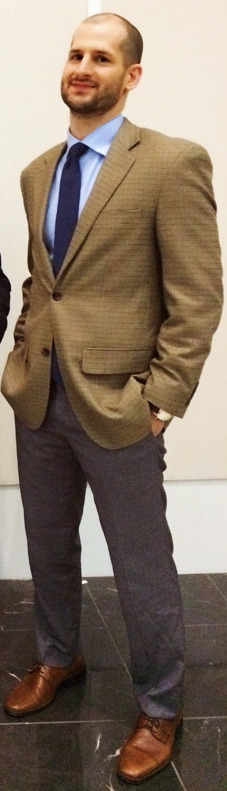

### Author
This blog is written and maintained by John Yeiser using the *distill* package in R. 

John is currently a post-doc at the University of Georgia. John works in the Martin Game Animal and Managed Ecosystem Lab, where he also got his PhD. He works with state and federal agencies to design, implement, and monitor broad-scale wildlife conservation. Before starting at UGA, John worked as a Wildlife Biologist for the state of Kentucky. 

You can learn more about his research by clicking on the "Research" link in the site header.

### Contact 
yeisjohn@gmail.com

```{r out.width= "25%", out.extra='style="float:right; padding:1px"'}

```


