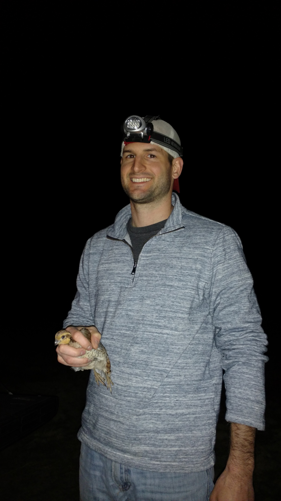

```{r setup, include=FALSE}
knitr::opts_chunk$set(echo = TRUE)
```

:::: {style="display: flex;"}

::: {}
John is currently a post-doc at the University of Georgia in the Martin Game Animal and Managed Ecosystems (GAME) lab, where he also got his PhD. He partners with colleagues at UGA and natural resource management agencies to design broad-scale monitoring projects, analyze big data, and inform conservation decision-making. Before starting UGA, John worked as a Wildlife Biologist for the state of Kentucky.

You can learn more about his research by clicking on the "Research" link in the site header.

John maintains this website using the *distill* package in RMarkdown. 

### Contact 
yeisjohn@gmail.com
:::

::: {}

```{r pressure, echo=FALSE, out.width= "100%", out.extra='style=" padding:10px"'}

```

:::

::::

