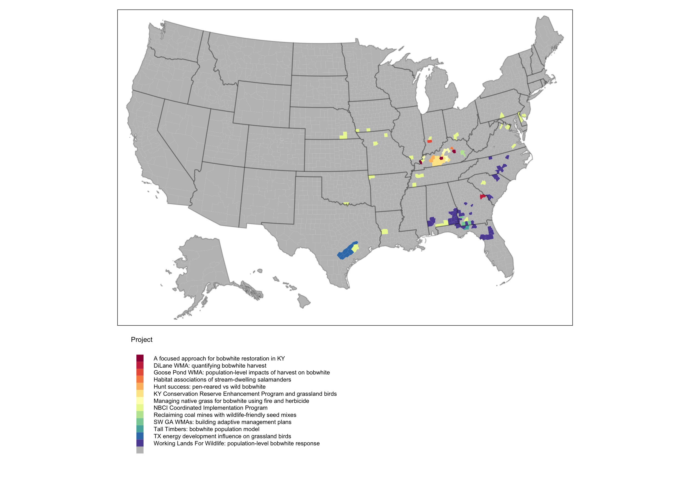

```{r setup, include=FALSE}
knitr::opts_chunk$set(echo = TRUE)
```

Broadly, I am an applied quantitative ecologist. I use advanced statistical methods, landscape ecology, population ecology, and decision science to inform broad-scale management and conservation. I'm extremely fortunate to work in a lab (the Martin GAME lab) that partners with state, federal, and non-government organizations to address pressing conservation issues. 

My primary research questions are: 

1. How do we conserve at-risk wildlife populations in fragmented ecosystems?
2. How do we optimize game species management to meet stakeholder objectives?
3. How do we best bridge the gap between research and conservation action?

The central themes of my research are broad-scale study design, population estimation, adaptive resource management, applied landscape ecology, applied simulation modeling, and remote sensing. The setting for my research is primarly working landscapes and publicly owned management areas.

### Projects
1. Understanding grassland bird population dynamics in working landscapes [@Yeiser2018JAE;@Yeiser2020EI;@YeiserRevisionConBio]

```{r echo=FALSE}

```
<!-- ### Wildife in Working Lands -->

<!-- Lands used to produce food and goods are home a substantial portion of the world's biodiversity. To keep up with the growing needs of human populations, working lands are expanding and intensifying, often simultaneously. It is important that we understand how these processes moderate ecosystem services, biodiversity, and outdoor recreation opportunities.  -->

<!-- We have a good idea of how conservation on working lands influences wildlife at local scales. Typically, conservation measures improve habitat quality for target species at the parcel scale and may result in greater local abundances. We know less about the degree to which these effects permeate into the landscape via population-level processes (e.g., dispersal). My focus has been on estimating the landscape-scale effects of conservation on bird populations in agricultural ecosystems.  -->

<!-- Major themes: broad-scale study design; landscape ecology; advanced distance sampling models; machine learning; habitat management; spatially explicit decision support tools; fostering partnerships -->

<!-- #### Projects -->

<!-- 1. Quantifying landscape-scale effects of conservation in agricultural ecosystems on grassland birds [@Yeiser2018JAE] -->

<!-- Grassland birds are one of the most imperiled groups in North America because of habitat loss. In the eastern US where most land is privately owned, grassland bird recovery may hinge on landowners choosing to restore habitat. Federally funded programs such as the Conservation Reserve Enhancement Program (CREP) provide incentives to landowners to convert active agriculture (e.g., cattle pastures) to wildlife habitat (e.g., native prairie vegetation). The CREP in Kentucky funded the conversion of 100,000 acres pastures to native prairie habitat within about 2 years. My dissertation centered around this conservation program and sought to answer 3 main questions: -->

<!-- 1. Did the CREP have population-level benefits to northern bobwhite and associated grassland birds? -->

<!-- 2. How do we optimize grassland conservation at regional scales to maximize benefits to grassland birds? -->

<!-- 3. Are landowners implementing key management recommendations? -->

<!-- ### Remote Sensing for Conservation -->

<!-- ### Applied Landscape Ecology -->

<!-- Resource management agencies are tasked with stewarding fish and wildlife populations to meet the demands of stakeholders (e.g., the public). This requires agencies to understand how the number and condition of individuals in populations vary over space and time. Understanding how populations change in response to conservation actions is particularly informative to the decision-making process that managers undertake. I work with agency partners to design research studies that will directly inform management or conservation decisions. Since these decisions impact resources across large areas for a long period of time, I use spatial and landscape ecology theory to inform these research projects. -->

<!-- Wildlife often occur in fragmented systems with variable surroundings, so there is rarely a one-size-fits-all management recommendation from our research. My colleagues and I apply our research to on-the-ground conservation by building decision support tools that can optimize conservation efforts in differing landscape contexts. -->

<!-- ### Adaptive Management -->

<!-- Many resource managers have mental models about the system in which they work. For example, a manager may think that chick survival is what bobwhite quail are missing on their management area. After they implement a management action to remedy the situation (e.g., improve brood-rearing cover), they assess the population and update their hypothesis. If the population goes up, they may conclude that chick survival was indeed limiting populations. If the population goes down or stays static, then they may conclude that some other factor is limiting population growth.  -->

<!-- Adaptive management is a great way to transfer mental models into a structured decision framework. My colleagues and I work directly with resource management agencies to identify problems and objectives, state and implement alternative management actions, and monitor and analyze the response of wildlife populations to those actions. At the end of this cycle, we can update our beliefs about which management alternative best meets their objectives. In theory, this process is repeated until the uncertainty around how the system works is very low. -->

<!-- ### Applied Simulation Modeling -->

<!-- Manipulative studies on wildlife populations are difficult because of the sample size requirements of common statistical analyses and the geographic and temporal scale at which populations operate. Simulation models are powerful tools that allow us to combine the results of small scale studies (e.g., vital rates estimated at different wildlife management areas) into comprehensive population simulation models. My colleagues and I use simulation models to hypothesize about the consequences of management actions on wildlife populations at large scales. We also use simulation modeling to inform our research study designs. -->
